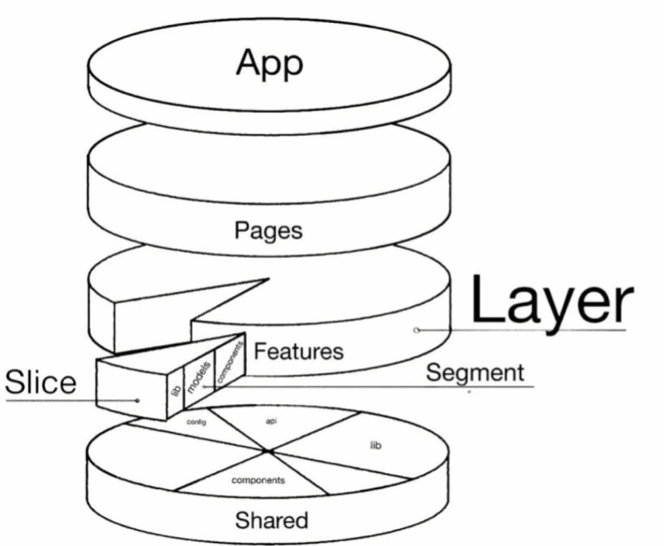
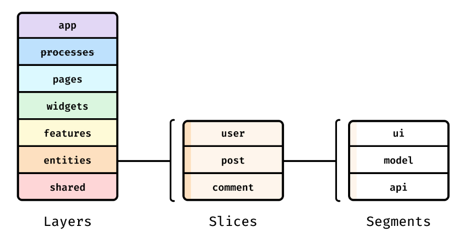

### База

- Это слоистая архитектура;
- Архитектура только для нашего кода;
- NPM в счет не берется, это своего рода ХАК - использование откуда хочешь;
- Config разположен в Shared, более правильно будет, чтоб он находился в App;
- Общение происходит строго Сверху Вниз. В FSD Верхнеуровневый слой может общатся СО ВСЕМИ нижним. По хорошему бы
  конечно чтоб Верхнеуровневый мог общатся только с тем слоем, что ниже (нижний тоже может общатся с верхним через
  callback-и, обсерверы, event-bus);



### FSD

#### Основой методологии является 3-и принципа:

- Публичный API (реализация DIP);
- Ограничение Низкая зацепленность и Высокая связность (особо актуально для уровня слайсов);
- Бизнес важнее абстракций.

#### Описание слоёв (сверху-вниз):

- app - не включается в себя слайсы, только сегменты и содержит логику инициализации;
- pages - включается в себя композицию виджетов, фич и сущностей;
- widgets - включается в себя композицию сущностей и фич;
- features - включается в себя композицию сущностей и реализацию БЛ в model + ui;
- entities - разрозненный набор подмодулей для испозования (очень близкая штука к features, различия появляются на этапе
  переиспользования);
- shared - содержит только инфраструктурю логику ui, lib, ui, api... без БЛ.

#### В качестве процесса проектирования выступает итерационный процессе анализа задачи "снизу-вверх":

- Выделяем shared логику;
- Выделяем entities логику;
- Выделяем features логику;
- Выделяем pages логику.



#### Структура

```
└── src/
    ├── app/                    # Layer: Приложение
    |                           #
    ├── processes/              # Layer: Процессы (опционально)
    |   ├── {some-process}/     #     Slice: (н-р процесс CartPayment)
    |   |   ├── lib/            #         Segment: Инфраструктурная-логика (helpers/utils)
    |   |   └── model/          #         Segment: Бизнес-логика
    |   ...                     #
    |                           #
    ├── pages/                  # Layer: Страницы
    |   ├── {some-page}/        #     Slice: (н-р страница ProfilePage)
    |   |   ├── lib/            #         Segment: Инфраструктурная-логика (helpers/utils)
    |   |   ├── model/          #         Segment: Бизнес-логика
    |   |   └── ui/             #         Segment: UI-логика
    |   ...                     #
    |                           #
    ├── widgets/                # Layer: Виджеты
    |   ├── {some-feature}/     #     Slice: (н-р виджет Header)
    |   |   ├── lib/            #         Segment: Инфраструктурная-логика (helpers/utils)
    |   |   ├── model/          #         Segment: Бизнес-логика
    |   |   └── ui/             #         Segment: UI-логика
    |   ...                     #
    |                           #
    ├── features/               # Layer: Фичи
    |   ├── {some-feature}/     #     Slice: (н-р фича AuthByPhone)
    |   |   ├── lib/            #         Segment: Инфраструктурная-логика (helpers/utils)
    |   |   ├── model/          #         Segment: Бизнес-логика
    |   |   └── ui/             #         Segment: UI-логика
    |   ...                     #
    |                           #
    ├── entities/               # Layer: Бизнес-сущности
    |   ├── {some-entity}/      #     Slice: (н-р сущность User)
    |   |   ├── lib/            #         Segment: Инфраструктурная-логика (helpers/utils)
    |   |   ├── model/          #         Segment: Бизнес-логика
    |   |   └── ui/             #         Segment: UI-логика
    |   ...                     #
    |                           #
    ├── shared/                 # Layer: Переиспользуемые ресурсы (ХАК слой)
    |   ├── api/                #         Segment: Логика запросов к API
    |   ├── config/             #         Segment: Конфигурация приложения 👿
    |   ├── lib/                #         Segment: Инфраструктурная-логика приложения
    |   └── ui/                 #         Segment: UIKit приложения
    |   ...                     #
    |                           #
    └── index.tsx/              #
```

#### Возможность переиспользуемости
Переиспользуемость бывает двух типов:
- внутри проекта;
- между несколькими проектами.

В FSD подрузомевается в 1-ую очередь именно 1-ый тип переиспользования слайсов (модулей). Некоторые вещи из инфраструктурного слоя могут повторно переиспользоваться в других проектах, при правильном проектировании. Но на практике такое стремление сильно ограничивает разработку и только небольшой процент базовых и очень абстрактных вещей может быть повторно переиспользовано между проектами.

Поэтому работая с FSD в первую очень следует рассматривать повторное использование слайсов внутри проекта.