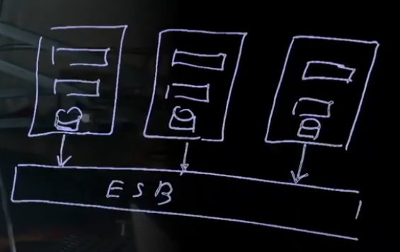

Последняя время в архитектуре принято выделять **монолитные** и **микросервисные** архитектуры. Однако это очень губое разделение и монолитная, и микросервисная имеет множество разных реализаций.

Существует много точек зрения на то, что является монолитом, но наиболее часто монолитами называют приложения с позиции развертывания - приложение, которые должны быть развернуты в едином цикле и могут работать только при выполнении всех этапов развертывания

_в монолите нет ничего плохо, под разные задачи и команды, надо выбирать из нужд_

[SOER.pro](https://platform.soer.pro/#!/pages/streams/kinescope/4b935ece-5b33-4093-b43b-f03ce8353f64)

## Монолиты
это архитектура с зацеплением

### Виды
- монолит единственного процесса (single process monolith);
- модульный монолит - хорошее гранулирование и минимальное кол-во связей между модулями;
- распределенный монолит - развертывание множество одинаковых монолитов

### Проблемы
- только вертикальное масштабирование;
- конфликты комманд; (из-за связанности)
- быстрый старт, но через год уже тяжело;
- проблема в подключение новых людей;
- зацепление и связность.

### Зацепление и связность
- зацепление кода;
- зацепление реализации;
- зацепление развертывания;
- временное зацепление (синхронность);

### Анализ монолитности

1. сначало необходимо построить диаграмму приложения (по модели С4);
2. поиск абстракций

_удачной абстракцией является аналогия с анатомией человека_

### Переход от монолита к модульности

Общая идея заключается в том, что можно до поры до времени не переходить на **микросервисную** или **сервисную** архитектуру, а перейти на **монолит модульный** ибо у нее достаточно большой срок жизни

`Монолит -> Монолит модульный -> Сервисная или Микросервисная архитектура`

и при этом есть ещё несколько вариантов перехода
- дублирование монолита - распределенный монолит;
- выращивание новой архитектуры рядом;
- досрочной переход на модульность (пока текущая архитектура не исчерпала ресурсы)

## Сервисный подход (Enterprise архитектура)
Это ряд систем, образующие приложение, общение которых происходит через обшую шину сообщений.

Сохранение монолитности может быть выполнено при использовании сервисной архитектуры, но при этом можно уйти от проблем развития и роста. 

_При правильной грануляции системы, возможно жить с монолитной архитектурой в рамках сервисной архитектуры._

## Микросервисы
Это по сути является "микромонолитом", и гибкость достигается за счет взаимодействия многих маленьких монолитов.

Важные элементы, которые должны быть учтены в микросервисной архитектуре:
- API;
- Балансировка;
- Оркестрация и хореография;
- Защита от сбоев;
- Шлюз;
- Мониторинг;
- Система конфигурирования;
- Обнаружение микросервисов.

_за счет независимости каждого сервиса усложняется система_