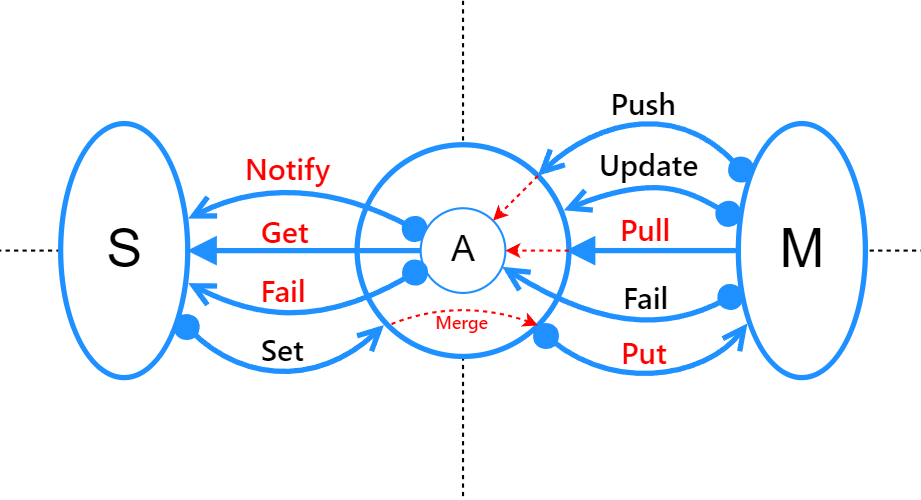

# Атом - минимальный кирпич реактивного приложения

**Атом - это абстракция, предназначенная**:
- для автоматизации слежения за зависимостями между переменными; 
- для эффективного обновления значений;

https://habr.com/ru/articles/235121/

## Основные свойства
1. Атом хранит в себе ровно одно значение;
2. Обращения к другим атомам отслеживаются так чтобы:
   - атом всегда имел актуальную информацию о том, какие другие атомы влияют на его состояние (dependencies);
   - атом всегда имеел состояние каких атомов зависит от его (reactions/subscribers);
3. При изменении значения атома зависимые от него должны обновиться каскадно;
4. Исключительные ситуации не должны нарушать консистентность состояния приложения;
5. Атом должен легко интегрироваться с императивным окружением;
6. Так как чуть ли не каждый слот памяти заворачивается в атом, то реализация атомов должна быть максимально быстрой и компактной.

## По стратегии использования
- `Источники состояния` — атомы, не умеющие вычислять своё значение. Они меняют его только, если кто-то специально в них его поместит;
- `Промежуточные` — атомы, с ленивым состоянием. Когда к ним обращаются, они вычисляют своё состояние на основе других атомов. Но когда у них не остаётся ведомых, то и они отписываются от ведущих;
- `Выводящие состояние` — атомы, которые императивно отражают изменение своего состояния во вне.

## Что хранит типичный атом
1. Собственно значение
2. Объект исключения
3. Текущее состояние:
   - не актуально
   - запланировано обновление
   - идет вычисление
   - актуально
   - ошибка
4. Множество ведущих атомов (dependencies)
5. Множество ведомых атомов (reactions/subscribers)
6. Максимальная глубина
7. Идентификатор
8. Пачку функций, реализующих нужное поведение

## Пример

- A — некоторый атом. 
  - Внутренний круг — это его состояние
  - Внешний — граница его интерфейса
- S — ведомая часть приложения
- M — ведущая часть, от которой зависит значение

_Стрелки означают поток данных. Жирные их концы символизируют инициатора взаимодействия. Красным помечены те интерфейсы, поведение которых можно уточнять с помощью пользовательских функций._

#### Интерфейсы
- `get` — запрос значения. Если значение не актуально, то происходит запуск pull для его актуализации.
- `pull` — та самая функция для вычисления значения атома. Когда он решает обновить своё значение он вызывает именно эту функцию.
- `push` — установить новое значение атома, но оно будет сохранено не как есть, а будет сначала пропущено через merge интерфейс 
- `merge` — сливает новое и текущее значение. Тут может быть нормализация, dirty-checking, валидация. 
- `notify` — уведомление ведомых о об изменении. 
- `fail` — уведомление ведомых о об ошибке. 
- `set` — через это интерфейс ведомый атом может предложить ведущему новое значение и если новое значение после merge отличается от текущего, то вызывается put. 
- `put` — по умолчанию делает push, но его назвачение в том, чтобы предложить новое состояние ведущему атому.
