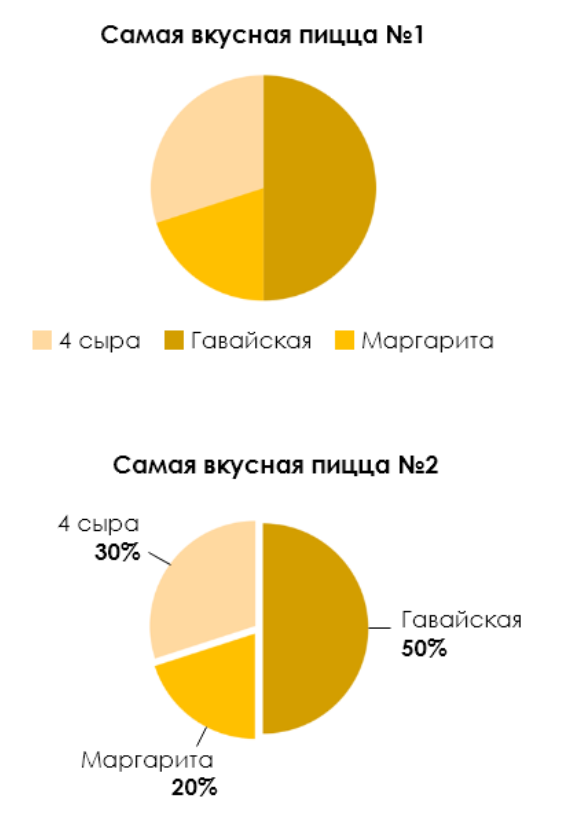
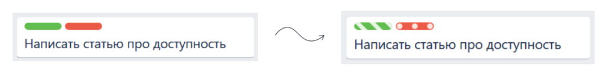

# Доступность

https://web.dev/articles/accessibility?hl=ru
https://habr.com/ru/companies/arcadia/articles/498476/
https://developer.mozilla.org/en-US/docs/Web/Accessibility/ARIA/ARIA_Guides
https://developer.mozilla.org/ru/docs/Learn/Accessibility/CSS_and_JavaScript

Это равноценный доступ к контенту у всех пользователей, в том числе с какими-либо нарушениями.

## Руководства ARIA
Доступные расширенные интернет-приложения (ARIA) определяют способы сделать Интернет более доступным для людей с ограниченными возможностями.

Контролирование перехода фокуса с помощь Tab используя `tabIndex`
- Элементы с положительным значением `tabIndex`. Элементы, имеющие идентичные tabIndex значения, следует перемещать в порядке их отображения;
- Элементы, которые не поддерживают `tabIndex` атрибут или поддерживают его и присваивают `tabIndex=0`;
- Элементы с значение `tabIndex=-1` неподдерживают изменение фокуса через Tab;

Наделяем семантически ролью `button` c помощью `role`, ролей очень много ещё есть

```html
<h1><span role="button">Hello</span></h1>
```

Дает скринридерам понимание с помощью `aria-label`, что за элемент у нас (опять же это надо делать не для всех элементов)

```html
<input
  type="search"
  name="q"
  placeholder="Search query"
  aria-label="Search through site content" />
```

Ещё дохуя таких атрибутов есть, были описаны самые базовые

## Об «ограниченных возможностях»
- **Зрение** - полная/частичная слепота/дальтонизм;
- **Слух** - полная/частичная глухота;
- **Опорно-двигательный аппарат** - различные виды параличей/тремор/отсутствие конечностей;
- **Ментальное развитие** - нарушения, связанные с восприятием информации/запоминанием.

## Кто и зачем должен внедрять accessibility?
Для этого необходима вовлеченность всей команды:
- **UX/UI дизайнеры** — проектируют интерфейсы, следуя гайдлайнам доступности;
- **Программисты** — пишут правильную разметку/верстку страниц, следят чтобы у всех элементов были необходимые теги и атрибуты;
- **Тестировщики** — проводят accessibility тестирование.

## Основные мотивации внедрения accessibility:
- **Эмпатия** - мы можем минимизировать препятствия, возникающие между пользователями и контентом, тем самым сделав их жизнь лучше;
- **Конкурентное преимущество** - повышение процента удовлетворенных пользователей. До 15% пользователей имеют постоянные, временные или ситуационные препятствия при взаимодействии с интернетом;
- **Закон** - необходимое условие при разработке продуктов для крупных международных проектов.

## Как внедрять accessibility?
Достаточно следовать существующим стандартам!
Существуют стандартные гайдланы:
- WCAG - https://www.w3.org/WAI/standards-guidelines/wcag/
- Section 508 - https://www.access-board.gov/guidelines-and-standards/communications-and-it/about-the-ict-refresh

## WCAG
Состоит из 4-ех принципов:
- Воспринимаемость
- Управляемость
- Понятность
- Надежность

Принципы включает в себя набор гайдлайнов, разделенных по уровням на:
- A — минимальная доступность
- AA — рекомендательный уровень
- AAA — максимальный уровень доступности, покрывающий специфические случаи

#### Вспомогательные технологии 
выступают «мостиком» между людьми с ограниченными возможностями и контентом:
- **Скрин-ридер** — сервис, позволяющий интерпретировать события, происходящие на экране, в удобном для пользователя формате;
- **Лупа** - позволяет увеличивать информацию на экране;
- **Альтернативные клавиатуры** - предназначены для возможности использования приложений людьми с нарушениями опорно-двигательного аппарата.
- **Распознавание речи** - позволяет выполнять действия по команде пользователей.

#### Доступ с клавиатуры
- **Весь контент** должен быть доступен с клавиатуры;
- **Недопустимость ловушек**: если доступ с клавиатуры не протестирован, могут возникать замкнутые круги;
- **Фокус на текущем блоке**: пользователи с нарушением опорно-двигательного аппарата и с ограниченным зрением должны понимать, на каком элементе они находятся прямо сейчас.
- **Последовательность информации**: при работе с контентом с клавиатуры пользователь должен получать информацию в логичной и понятной для него последовательности.

#### Названия элементов
_При использовании скрин-ридера в комбинации с клавиатурным доступом, устройство оповещает пользователя об элементах, с которыми он взаимодействует._

**Пользователям с ограничениями критически важно понимать, на каком элементе экрана (тексте, кнопке, картинке, видеозаписи) он находится прямо сейчас и какие действия он может совершить.** 

Для обеспечения доступности важно указывать четкие и понятные названия для всех элементов контента.

#### Цвет
**Первое правило** — нельзя преподносить важную информацию исключительно с помощью цвета, следует использовать дополнительные маркеры.





**Второе правило** касается контрастности изображений

Гайдлайны WCAG позволяют избежать недоразумения: используя минимальное рекомендованное соотношение контрастности между соседствующими на экране цветами, мы сможем помочь пользователям с дальтонизмом эффективно взаимодействовать с контентом.

Как бы выглядел бы контент для дальтоника https://www.toptal.com/designers/colorfilter/

#### Вспышки
Даже незначительная вспышка в уголке экрана может сделать весь контент страницы недоступным для восприимчивого пользователя. 

## Тестирование существующих и новых продуктов
- Скрин-ридеры - есть бессплатная программа NVDA, через можно протестировать - узнать как выглядит сайт для людей с проблемами;
- Автоматические отчеты о доступности - Lighthouse;

## Ссылки
- Чеклист WCAG по доступности - https://www.webfx.com/blog/web-design/website-accessibility-checklist/
- Инструмент для тестирования - https://www.getstark.co/
- Как выглядит для дальтоников - https://www.toptal.com/designers/colorfilter/