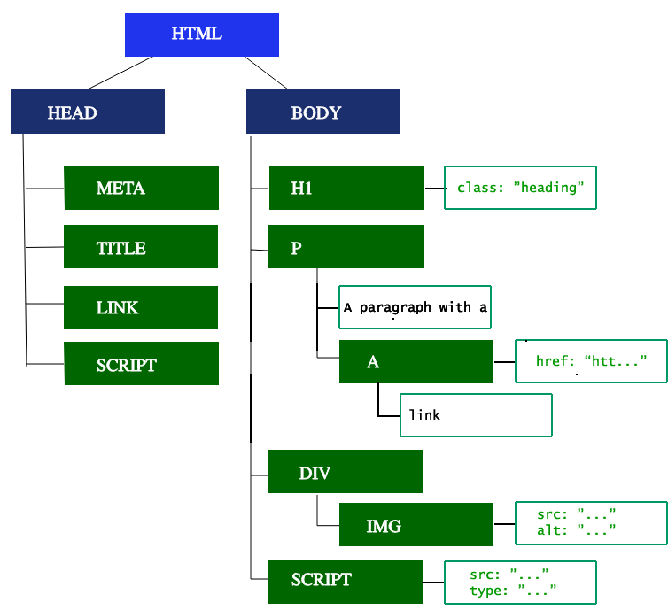

# Как работает Браузер

https://developer.mozilla.org/ru/docs/Web/Performance/How_browsers_work

Пользователи хотят использовать приложения, в которых загрузка контента происходит быстро, а взаимодействие - плавно. 

## Определения
- `Time to First Byte` - это время между моментом когда пользователь отправил запрос, скажем, нажав на ссылку, и моментом получения первого пакета данных HTML;
- `First contentful paint` - время, за которое пользователь увидит какое-то содержимое веб-страницы, например, текст или картинку;
- `Time to Interactive` -  это показатель того, как много времени проходит между самым первым сетевым запросом и моментом, когда страница становится интерактивной;

## Кратко как работает
1. Навигация
   - DNS запрос - получаем ip-адрес
   - TCP рукопожатие - устанавливаем соединение
   - TLS Переговоры - дополнительно делаем соединение безопастным (HTTPS)
2. Ответ на запрос
   - TCP медленный старт - пакет содержащий информацию о скорости передаваемых данных
3. Парсинг
   - Построение дерева объектной модели документа
   - Загрузка ресурсов
   - Построение модели стилей CSSOM
   - Компиляция JavaScript
   - Построение дерева доступности - объектная модель доступност (accessibility object model, AOM)
4. Рендеринг - используем DOM и CSSOM готовых на 3 этапе 
   - Стилизация - DOM + CSSOM = дерево рендера
   - Компоновка - подсчитываем геометрию каждого элемента
   - Отрисовка - подсчитанную геометрию преобразуем в пиксели
   - Композиция - рисует элементы с z-index в правильном порядке 
5. Интерактивность - во время обработки браузер не может обрабатывать события прокрутки, нажатий и др.

## 1. Навигация
Он происходит каждый раз, когда пользователь запрашивает страницу, вводя URL в адресную строку браузера, нажимает на ссылку, отправляет заполненные поля формы и выполняет некоторые другие действия.

### DNS запрос
Первый шаг навигации к странице - это поиск места, откуда нужно запрашивать данные.

### TCP Рукопожатие (Handshake)
В тот момент, когда IP адрес становится известен, браузер начинает установку соединения к серверу с помощью рукопожатия TCP.

### TLS Переговоры
Для **установки безопасных соединений** с использованием HTTPS требуется ещё одно рукопожатие. На этот раз - TLS переговоры. На этом шаге определяется:
- какой шифр будет использоваться для шифрования соединения;
- удостоверяется надёжность сервера;
- устанавливается безопасное соединение.

## 2. Ответ на запрос
Как только мы установили соединение с веб-сервером, браузер отправляет инициирующий `HTTP GET` запрос от имени пользователя. Чаще всего запрашивается HTML файл. В момент, когда сервер получает запрос, он начинает ответ с посылки заголовков ответа и содержимым HTML-файла.

```html
<!doctype html>
<html lang="en">
  <head>
    <meta charset="UTF-8" />
    <title>My simple page</title>
    <link rel="stylesheet" src="styles.css" />
    <script src="myscript.js"></script>
  </head>
  <body>
    <h1 class="heading">My Page</h1>
    <p>A paragraph with a <a href="https://example.com/about">link</a></p>
    <div>
      
    </div>
    <script src="anotherscript.js"></script>
  </body>
</html>
```

### TCP медленный старт
**Объём первого пакета данных** - всегда 14KB. Это часть спецификации TCP slow start - алгоритма, который балансирует скорость соединения. Такое правило позволяет постепенно, по мере необходимости увеличивать размеры передаваемых данных, пока не будет определена максимальная ширина канала.

## 3. Парсинг
Как только браузер получает первый кусочек данных, он сразу начинает обрабатывать получаемую информацию. Получаемые данные преобразуются в:
- DOM - это внутреннее представление разметки HTML в виде объектов;
- CSSOM - аналогично +- DOM, но только в другой структуре;

### Построение дерева объектной модели документа
Первый шаг - это обработка разметки HTML и построение дерева DOM.
  
Объектная модель документа (DOM) описывает содержимое документа. Элемент <html> - это первый тег и корневой элемент дерева документа. Дерево отражает связи и иерархию между разными тегами.



### Загрузка ресурсов (css, js, image...)

Когда парсер находит **неблокирующие ресурсы** (например, изображения), браузер отправляет запрос на загрузку ресурсов, но сам продолжает обработку.

Обработка может продолжаться когда обнаружена ссылка на CSS файл, но если обнаружен `<script>`, особенно если он без параметров `async` или `defer` - такой скрипт **считается блокирующим и приостанавливает обработку HTML** до завершения загрузки скрипта.

### Построение модели стилей CSSOM
Второй шаг при прохождении критического пути рендеринга - это обработка CSS и построение CSSOM дерева. CSSOM (объектная модель CSS) похожа на DOM. 

CSSOM дерево включает в себя стили пользовательского агента - это стили, которые браузер вставляет по умолчанию. Браузер начинает построение модели с наиболее общих правил для каждого узла, постепенно применяя более специфичные правила.

## 4. Рендеринг
CSSOM и DOM деревья, созданные на предыдущем этапе комбинируются в дерево рендера, которое затем используется для расчёта положения каждого видимого элемента

### Стилизация
Это комбинирование DOM и CSSOM в `дерево рендеринга`.

Элементы, которые не должны быть показаны, например, _<head>, а так же их дети или любые элементы с display:none, такие как script { display: none; }, не будут включены в дерево рендера, так как они не должны быть отрисованы._

### Компоновка (Layout)
- `Layout (Компановка)` - это запуск компоновки элементов дерева рендера. На этом шаге вычисляется геометрия каждого узла, то есть ширина, высота, положение элементов.
- `Reflow (перекомпоновка)` - это любой последующий процесс определения размеров и позиции для любой из частей целого документа.

### Отрисовка (Paint)
Это отрисовка каждого отдельного узла на экране. Момент, когда это происходит впервые, называется first meaningful paint (первая значащая отрисовка). 

Во время фазы отрисовки или растеризации, браузер конвертирует каждый контейнер box в настоящие пиксели на экране (напомним, что данные контейнеров формируются на этапе layout)

Отрисовка может разбить элементы в дереве рендера на слои. Для того, чтобы ускорить их рендер, браузер может перенести отрисовку разных слоёв на GPU (вместо основного потока CPU).

### Композиция (Compositing)
Позволяет браузеру гарантировать, что каждый слой отрисован на экране в правильном порядке, а содержимое отображается корректно. Шаг выполняется, когда элементы отрисованы на разных слоя.

## 5. Интерактивность
Можно было бы подумать, что как только основной поток завершает отрисовку страницы - "всё готово". Это не всегда так. Если среди загружаемых ресурсов есть JavaScript, загрузка которого была корректно отложена (async, defeat).

Запуск которого происходит только после события **onload**, основной поток начинает обработку скриптов. **Во время этой обработки браузер не может обрабатывать события прокрутки, нажатий и др.**