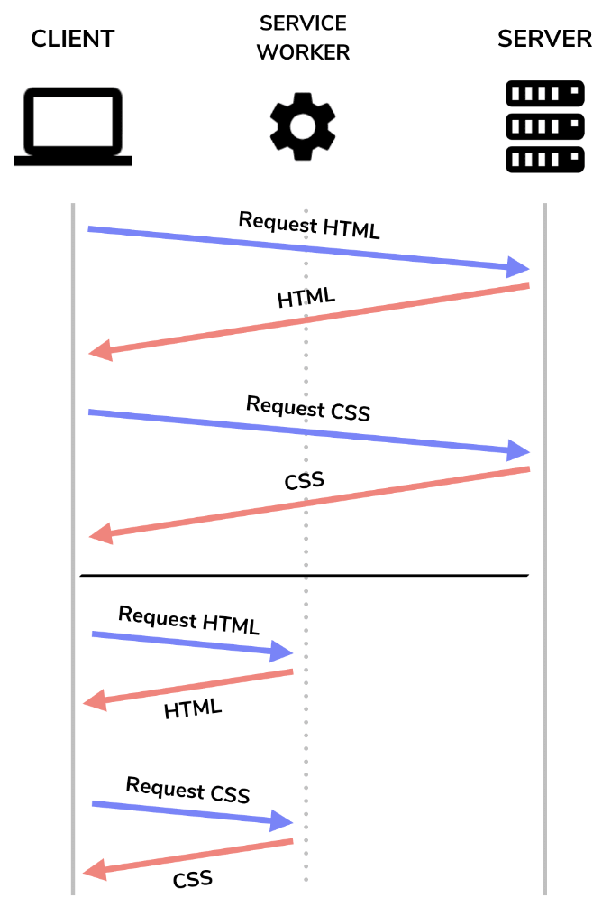

# PRPL 

https://www.patterns.dev/vanilla/prpl
https://web.dev/articles/apply-instant-loading-with-prpl?hl=ru

- **Предварительная** загрузка поздно обнаруженных ресурсов;
- **Отрисуйте** первоначальный маршрут как можно скорее.
- **Предварительно** кэшируйте оставшиеся ресурсы;
- **Ленивая** загрузка других маршрутов и некритических ресурсов;

## Предварительная загрузка критически важных ресурсов
**Предварительная загрузка** — это декларативный запрос на выборку, который сообщает браузеру запросить ресурс, который в противном случае не может быть обнаружен сканером предварительной загрузки браузера,

Предварительно загрузите недавно обнаруженные ресурсы, добавив тег `<link> с rel="preload"` в заголовок вашего HTML-документа:

`<link rel="preload" as="image" href="hero-image.jpg">`

_Вместо того, что писать логику загрузки картинок_

## Отрисуйте первоначальный маршрут как можно скорее
**First Paint** — момент, когда ваш сайт отображает пиксели на экране:

`Чтобы улучшить First Paint, Lighthouse рекомендует встроить критический JavaScript и отложить выполнение остальных с помощью async , а также встроить критический CSS, используемый в верхней части страницы.` Это повышает производительность за счет исключения повторных обращений к серверу для получения ресурсов, блокирующих рендеринг

Другой подход к улучшению `First Paint — отрисовка исходного HTML-кода вашей страницы на стороне сервера.` При этом контент отображается пользователю немедленно, пока скрипты еще извлекаются, анализируются и выполняются.

## Предварительное кэширование ресурсов
Действуя в качестве прокси-сервера, `Service Worker` могут получать ресурсы **непосредственно из кэша, а не с сервера при повторных посещениях.** Это не только позволяет пользователям использовать ваше приложение, когда они не в сети, но также приводит к ускорению загрузки страниц при повторных посещениях.

## Ленивая загрузка
Большие полезные нагрузки JavaScript являются особенно дорогостоящими из-за того, что браузеру требуется время для их анализа и компиляции.

Чтобы отправить меньшую полезную нагрузку JavaScript, содержащую только код, необходимый при первоначальной загрузке приложения пользователем, **разделите весь пакет и отложите загрузку фрагментов по требованию**.

https://web.dev/articles/preload-critical-assets?hl=ru