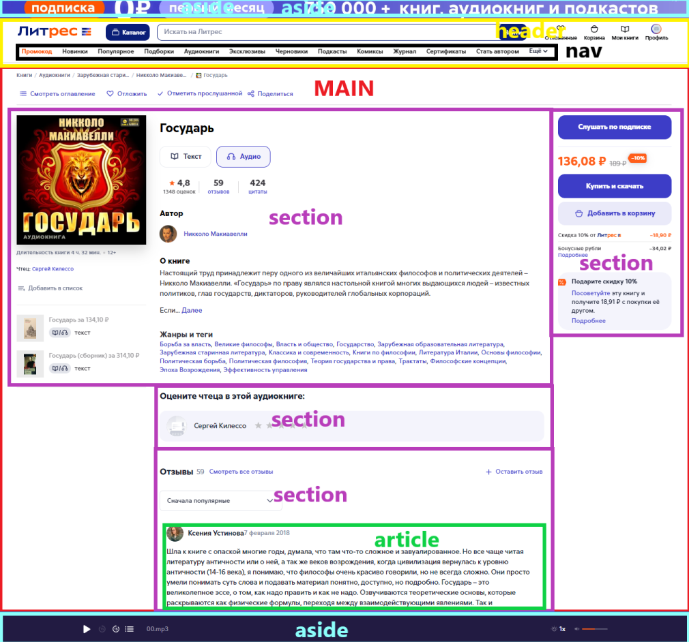

# Семантик
https://habr.com/ru/companies/htmlacademy/articles/546500/
https://cs.fyi/guide/writing-semantic-html

Семантическая вёрстка — подход к разметке, который опирается не на внешний вид сайта, а на смысловое предназначение каждого блока и логическую структуру документа.

## Предназначения
- Делать сайт более доступным;
- Помогает поисковым ботам лучше понимать, что находится на странице;
- Делает верстку "более читабельной";

## Основные семантические теги
- `header`   - вводная часть смыслового раздела или всего сайта, обычно содержит подсказки и навигацию;
- `nav`      - навигационный раздел со ссылками на другие страницы или другие части страниц;
- `main`     - основное, не повторяющееся на других страницах, содержание страницы;
- `footer`   - заключительная часть смыслового раздела или всего сайта, обычно содержит информацию об авторах, список литературы, копирайт и так далее;

- `aside`    - используется для выделения контента, который связан с основным контентом веб-страницы, но не является ее неотъемлемой частью. Пример: реклама, дополнительная информация, тостеры, хинты, алерты и т.д.;
- `section`  - используется для выделения разделов веб-страницы, которые тематически сгруппированы вместе. Это может включать такие вещи, как главы или разделы длинной статьи, или различные части страницы продукта. Пример `section` контента и ниже `section` комментариев;
- `article`  - используется для представления отдельного фрагмента контента, такого как сообщение в блоге, новостная статья или обзор продукта. Содержимое тега `article` должно быть самодостаточным и значимым и может включать заголовки, абзацы, изображения и другие типы контента.

## Сомневаюсь, какие теги использовать
Простые правила для выбора нужных тегов.
- Получилось найти самый подходящий смысловой тег — использовать его;
- Для потоковых контейнеров — `div`;
- Для мелких фразовых элементов (слово или фраза) — `span`.

Правило для определения `article`, `section` и `div`:
- Можете дать имя разделу и вынести этот раздел на другой сайт? — `article`;
- Можете дать имя разделу, но вынести на другой сайт не можете? — `section`;
- Не можете дать имя? Получается что-то наподобие «новости и фотогалерея» или «правая колонка»? — `div`.

