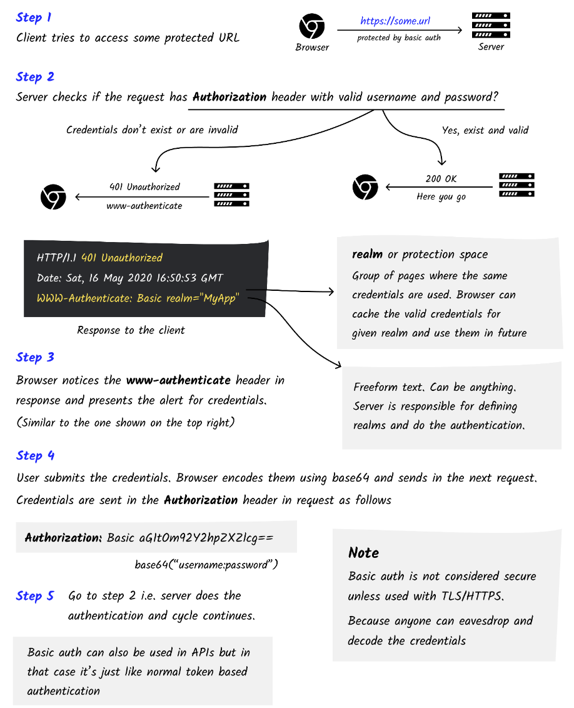

# Basic Auth

https://roadmap.sh/guides/basic-authentication.png

Механизм аунтентификации по протоколу HTTP, где учетные данные пользователя отправляется в заголовке запроса в виде Base64:
`Auth: Base aGltOm922XJhY2hp2X2lcg==`

