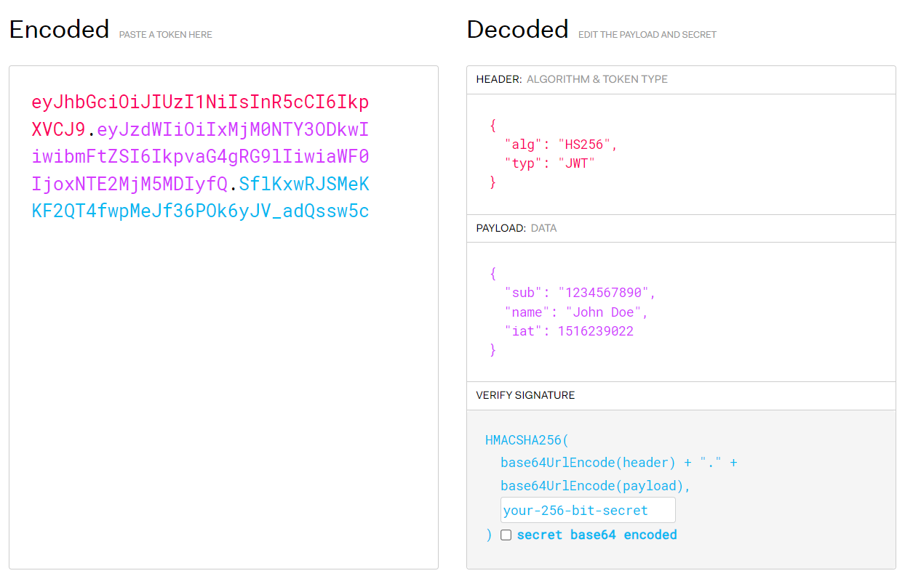
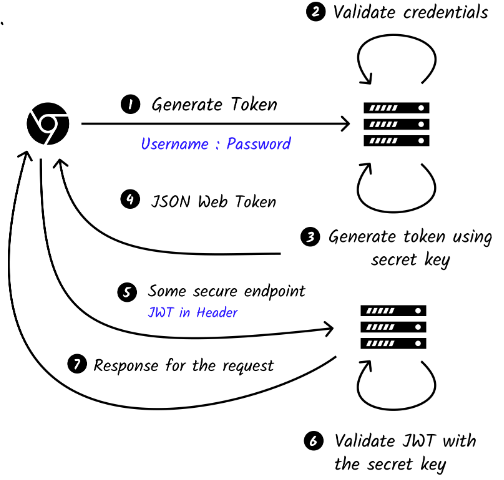

# Json Web Token Authentication

- https://habr.com/ru/companies/vk/articles/343288/
- https://jwt.io/introduction
- https://jwt.io/#debugger-io
- https://roadmap.sh/guides/jwt-authentication

JWT - это открытый стандарт (RFC 7519), который определяет компактный и автономный способ безопасной передачи информации между сторонами в виде объекта JSON. JWT могут быть подписаны с использованием секрета (с помощью алгоритма HMAC) или пары открытый / закрытый ключи с использованием RSA или ECDSA.

## Когда следует использовать

### Авторизация
Это наиболее распространенный сценарий использования JWT. Как только пользователь войдет в систему, каждый последующий запрос будет включать JWT, позволяя пользователю получать доступ к маршрутам, службам и ресурсам, которые разрешены с помощью этого токена.

### Обмен информацией
JWT являются хорошим способом безопасной передачи информации между сторонами. Поскольку JWT могут быть подписаны — например, с использованием пар открытый / закрытый ключи — вы можете быть уверены, что отправители те, за кого они себя выдают. 

## Что такое структура JWT
JWT состоит из трех частей, разделенных `.`, которые являются:
- Заголовок
- Полезная нагрузка
- Подпись

`xxxxx.yyyyy.zzzzz`

### Заголовок
Заголовок обычно состоит из двух частей:
- тип токена;
- алгоритм подписи;

```json
{
  "alg": "HS256",
  "typ": "JWT"
}
```

### Полезная нагрузка
Утверждения - это утверждения о сущности (обычно, пользователе) и дополнительных данных. Существует три типа утверждений:
- Зарегистрированные утверждения
- Публичные утверждения
- Частные заявки

```json
{
  "sub": "1234567890",
  "name": "John Doe",
  "admin": true
}
```

Затем полезная нагрузка кодируется в `Base64Url` для формирования второй части веб-токена JSON.

### Подпись
Чтобы создать часть подписи, вы должны взять закодированный заголовок, закодированную полезную нагрузку, секрет, алгоритм, указанный в заголовке, и подписать это.

## Сведение всего воедино
Выходные данные представляют собой три строки Base64-URL, разделенные точками.


## Как работает
1. Пользователь входит в систему, используя свои данные;
2. Сервер отправляет успешный ответ с JWT;
3. Всякий раз, когда пользователь хочет получить доступ к защищенному маршруту или ресурсу, агент пользователя должен отправлять JWT, обычно в заголовке авторизации, используя схему Bearer. Содержимое заголовка должно выглядеть следующим образом: `Authorization: Bearer <token>`

