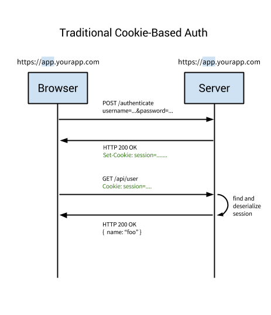

# Session Based Authentication
Аутентификационная запись или сессия должны храниться и на сервере, и на клиенте. Сервер должен отслеживать активные сессии в базе данных или памяти, а на фронтенде создаётся кука, в которой хранится идентификатор сессии. Это аутентификация на основе куки, самая распространённый и широко известный метод, используемый уже давно.

## Шаги
1. Пользователь вводит в браузере своё имя и пароль, после чего клиентское приложение отправляет на сервер запрос;
2. Сервер проверяет пользователя, аутентифицирует его, шлёт приложению уникальный пользовательский токен;
3. Клиентское приложение сохраняет токены в куках и отправляет их при каждом последующем запросе.
4. Сервер получает каждый запрос, требующий аутентификации, с помощью токена аутентифицирует пользователя и возвращает запрошенные данные клиентскому приложению;
5. Когда пользователь выходит, клиентское приложение удаляет его токен.

У этого метода несколько недостатков.
- При каждой аутентификации пользователя сервер должен создавать у себя запись;
- Поскольку сессии хранятся в памяти, масштабировать не так просто. Если вы многократно реплицируете сервер, то на все новые серверы придётся реплицировать и все пользовательские сессии.