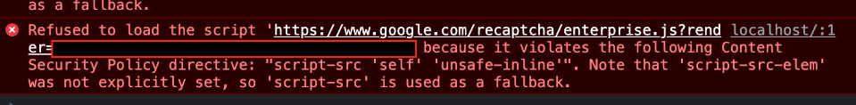

# Content Security Policy

неинтересная хуйня
https://habr.com/ru/articles/757332/

Content Security Policy - это механизм безопасности веб-приложений.

CSP позволяет веб-разработчикам указывать браузерам из каких источников разрешено загружать ресурсы, такие как скрипты, стили, изображения, шрифты и другие элементы через специальный заголовок `Content-Security-Policy`

## Настройка

Настройка происходит, как на сервера через отправку контент с заголовком `Content-Security-Policy`, так и на стороне клиента через `<meta http-equiv="Content-Security-Policy" content="наши правила"/>`

Настройка начинается с того, что сначала мы запрещаем все, а потом начинаем добавлять исключения по средством внесения изменений.

1. Сначала запрещаем все - добавляем в наши правила `"script-src 'self' 'unsafe-inline'"`. 
Если у нас внедрены стороние источники в приложение: метрики, капчи и т.д., то мы увидем:



2. Добавляем нашу капчу в список разрешенных 
```
"script-src 'self' 'unsafe-inline', https://www.google.com/recaptcha/"
```


...