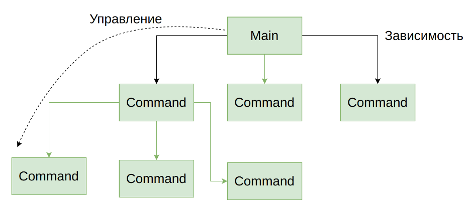
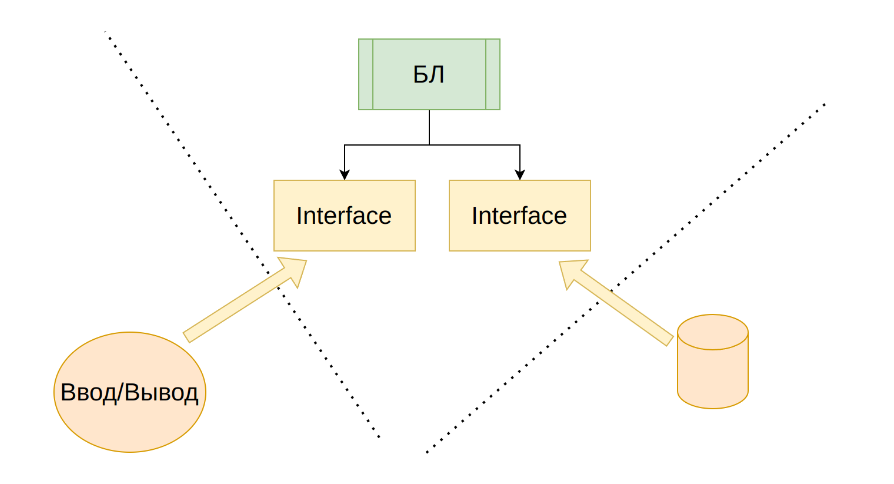
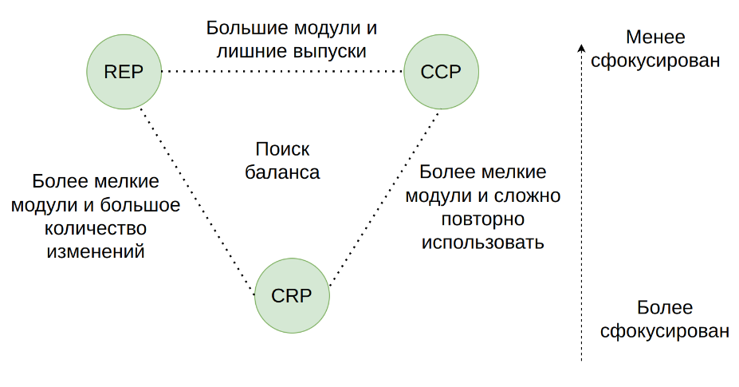
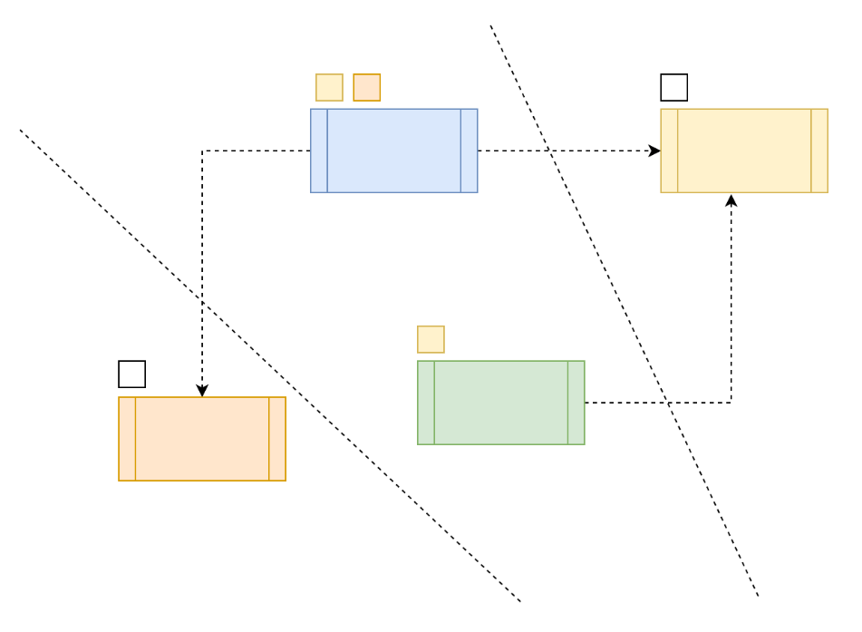
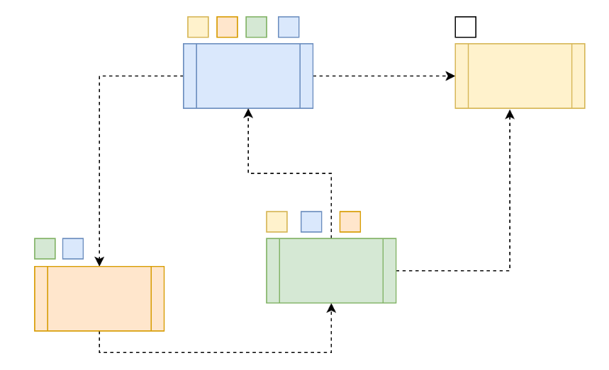
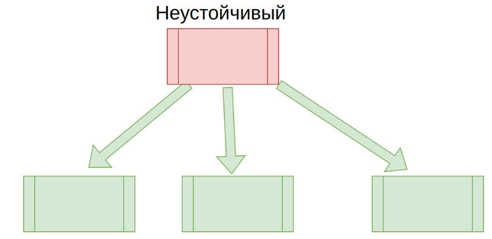
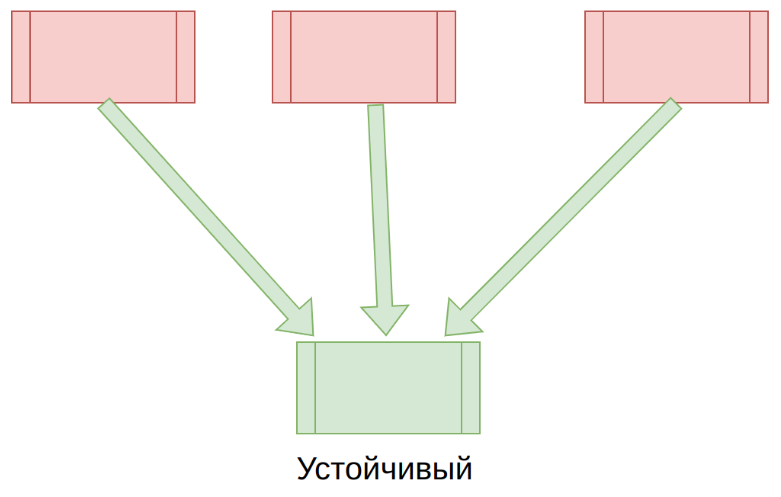

https://platform.soer.pro/#!/pages/streams/conspect/view/3195

Основная задача архитектора на проекте - правильно разделить обязанности, провести архитектурные границы, ограничить лишнюю зацепленность и обеспечить нужную связность. Отсюда возникают вопросы:

* Как провести границы?
* Как определить зависимости?
* Как обеспечить управляемость?

## Зависимости
Существует два основных направления на схемах, отражающих архитектуру уровня кода, это:

* направление зависимостей;
* направление потока управления

Основная проблема архитектуры заключается в том, что зависимостей нельзя избежать, но ими можно управлять. Основной императив "инфраструктура должна зависеть от бизнес логики, а не наоборот". Таким образом бизнес логика должна обеспечивать "ядро" функционирования системы.

## Границы
Основная задача архитектора - грануляция система на маскимально "независимые" компоненты. Эта задача достигается за счет проведения границы. Визуально граница на диаграмме выглядит как разделяющая линия, в логическом смысле - это способ сказать "здесь моя территория, я принимаю решение".

Проведение границ - это один из способов разделения обязанностей. Внутри границ должны находится только те вещи, которые реально входят в зону моей ответственности и компетенции. А все неважные вещи, должны выносится за границы.

Границы должны позволять разделить систему на уровни абстракции, чем ближе к вводу/выводу, тем ниже уровень абстракции.

## Связность
Существует отдельный вопрос - на чем должен фокцсироваться модуль? Как сделать так, чтобы эта фокусировка была максимальной? Это регулируется понятием "связность" и определяется тремя принципами.

- Принцип эквивалентного повторного использования (REP)
- Принцип согласованного изменения (CCP)
- Принцип совместного повторного использования (CRP)

### Reuse Equivalence Principle
-- это принцип эквивалентного повторного использования Компоненты, включенные в модули должны выпускаться одновременно и является единицей выпуска (расширение компонента).

Все что необходимо должно модулю должно лежать в нем (пакеты, библиотечки допустим не извне, а в нем).

Необходим для более "гладкой, легкой" сборки, не надо допустим подтягивать какие-то модули, пакеты т.к. все уже собрано в одном месте. Порадуйте своего DevOps-а

### Common Closure Principle
-- это принцип согласованного изменения Компонент должен включать, то что менятся одновременно, с общей причиной изменения (расширение компонента).

Можно сказать, что это SRP, но в под углом модуля и его компонентов.

Необходим для поддерживание модуля: новые фичи, изменение логики, фикс багов и т.д.. За счет того все согласованные по изменению компоненты собраны вместе, при изменение, фиксе багов и т.д. будет изменятся только этот модуль.

### Common Reuse Principle
-- это принцип совместного повторного использования Компонент не должен зависеть от того, что ему не требуется (уменьшение компонента);

Необходим для более лучшей разработки - за счет того, что у нас множество модулей, у нас может быть множество количество команд... - горизонтальное масштабирование.

## Ациклические зависимости
Квадратики над компонентом/модулем показывается при изменение каких компонентов/модулей изменится этот компонент/модуль.

На этом графике гранулирования можно предлоложить, что:
- синий и зеленный - подходят под модуль Бизнес логики
- желтый и оранжевый - UI модуль и БД модуль

Получается у нас здесь можно 3 команды задействовать и потом наращивать каждый модуль.

На это графике не проведено границы, но как сказал Слон, если видим компоненты в ациклической завимости, то это 100% модуль. Как мы видим желтый сам по себе, а в от синий, зеленный и оранжевый образуют модуль

- желтый какой-то модуль
- синий, оранжевый и зеленный компонент образуют вместе модуль

Ну и тут минусы по сравнению с 1-ым графиком очевидны
1. 2 команды можно ток подключить
2. раздутый модуль с синим, оранжевым и зеленным компонентом
3. меньше путей решений

## Устойчивость и абстракция

Понятие "технической" устойчивости - это фактические связи, которые делают компонент устойчивым или нет. 
Понятие "логическая" устойчивость - это когда класс моделирует мало изменчивую часть БЛ. Если они не совпадают - это большая проблема.

Нужно всегда следить, чтобы устойчивые с технической стороны компоненты, были устойчивы и логически.

... тут лучше посмотреть последний 15мин