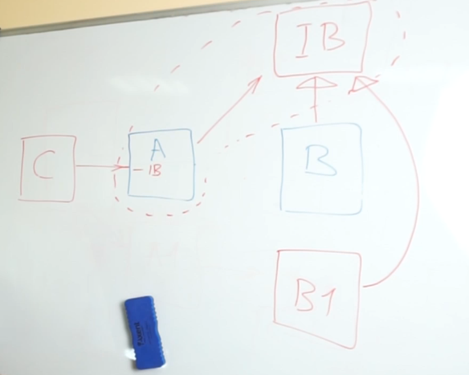

#### Общие шаблоны распределения отвественности

https://ru.wikipedia.org/wiki/GRASP
https://habr.com/ru/companies/otus/articles/521476/

- **Информационный эксперт** - где находятся данные, там они должны и обрабатываться
- **Создатель** - объект должен создаватся там, где он нужен. Может интерпретировать, как информационный эксперт, но только в качестве обработки создания объектов.
- **Контроллер** - отвечает за обработку операциий, запросов, которые приходят от пользователя/из какого-то внешнего источник
- **Слабое зацепление** - чем меньше связей в системе тем лучше
- **Высокая связность** - элементы внутри объекта тесно связаны и сфокусированы. Все разнородное надо вынести в другой объект. 
- **Полиморфизм** - обработка различные вариантов поведения система. Допуск замены частей системы. Достигается за счет предоставления внешней системе своего интерфейса, который может реализовать другая система.
- **Чистая выдумка** - это объект, который не отражает реальности сущности из предметной области, обёртка вокруг одного класса, чтоб меньше зависимостей было. Фасад, посредник, медиатор - паттерны из GoF, что являются Чистой выдумкой. 
- **Перенаправление** - реализует низкую связанность между классами A и B, за счет добавления класс C.  MVC, MVP реализует данный шаблон. Ну и можно сопоставить +- IoC, DI. Паттерны: адаптер, proxy, фасад...
