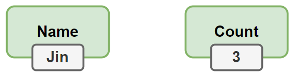
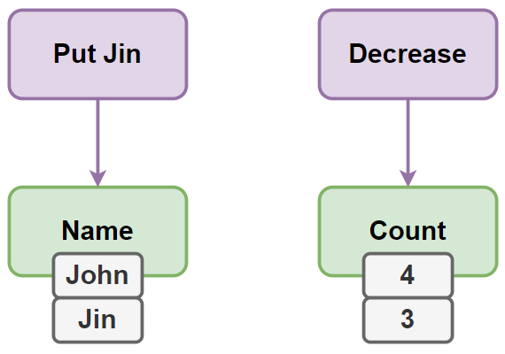
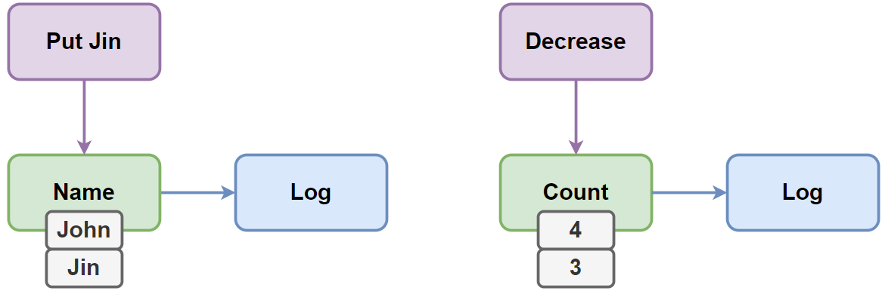
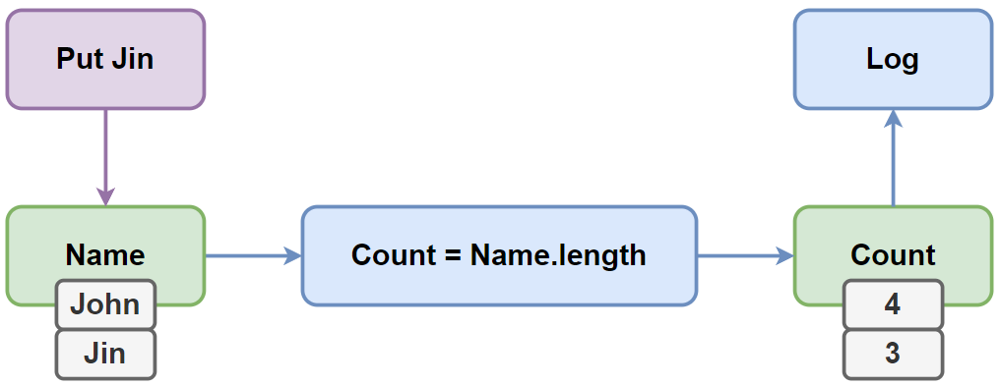
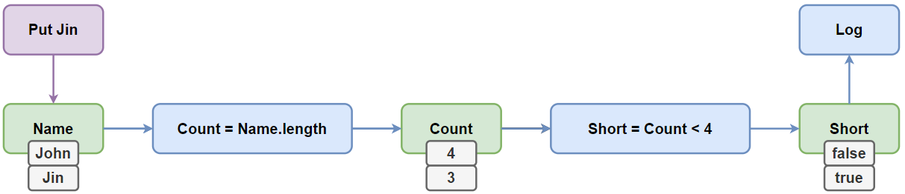
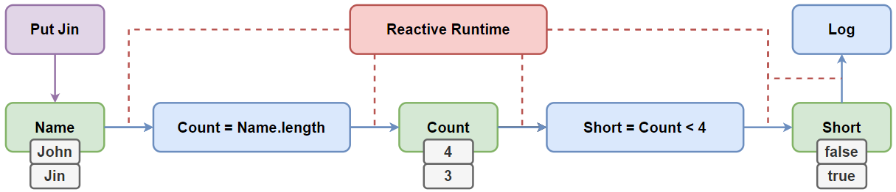

## Реактивность
[Система реактивная](https://page.hyoo.ru/#!=vuypgx_v55bpt), когда при обновление состояния зависимые от этого части обновляются автоматически, само состояние, класс где было изменено состояние не знает о зависимых от данного состояния частей системы.

## Составные часты

### Состояние
Контейнеры, хранящие некоторое состояние

### Действия
Изменение состояния

### Реакция
Действия на изменение состояния

### Инвариант
Соотношение одного состояния к другому, возникает, когда побочным действие реакции является измение другого состояния**

### Каскад
Прелесть инвариантов в том, что мы можем привязать ими все состояния приложения в единый граф.

Таким образом измение одного состояния каскадно отобразится на всём приложении автоматически. Т.е. мы получаем ту самую реактивность.

### Runtime
И чтобы реактивность корректно заработало, необходим некоторых Runtime/механизм, который будет отслеживать изменение одних состояний и обновлять значение других в соотвествие с заданными инвариантами.

## Характеристики

### Разумность
Лишнии вычисления сами по себе постепенно замедляют вычисления и с тем, что измение одного каскадно изменяет многое, происходит слишком много лишних действий.

### Экономия
Реактивность весьма не бесплатная. Помимо собственного состояния необходимо также хранить разную мета-информацию, объем которой может быть в несколько раз больше.

[подробнее...](https://page.hyoo.ru/#!=bgoytp_77kuaw/View'bgoytp_77kuaw'.Details=%F0%9F%92%B8%20Economy)

### Стабильность
После изменения состояния, результат должен быть такой же, как старт с нуля в этом же состояние - всегда при опреденных действия будет одно и тоже состояние.

_Звучит, вроде бы, самоочевидно, но вы ужаснётесь, когда узнаете, что стабильность поведения почти нигде не гарантируется. В результате возможна ситуация, когда программист взял тот же самый код, открыл те же самые окошки, ввёл те же самые значения.. но у пользователя баг есть, а у программиста он не воспроизводится. И тут начинается весёлая отладка._

### Согласованость/Последовательность
Состояния должны быть согласованы между собой в любой момент времени.

_Если пользователь (или другая программная система), пусть даже на мгновение, увидит рассогласование, то в лучшем случае он будет обескуражен. В худшем - и вы, и он потеряете деньги, репутацию и прочие плюшки._

