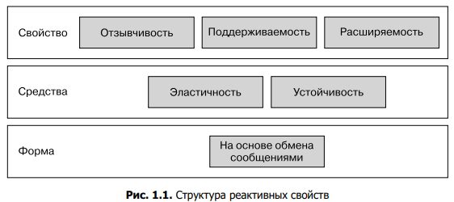
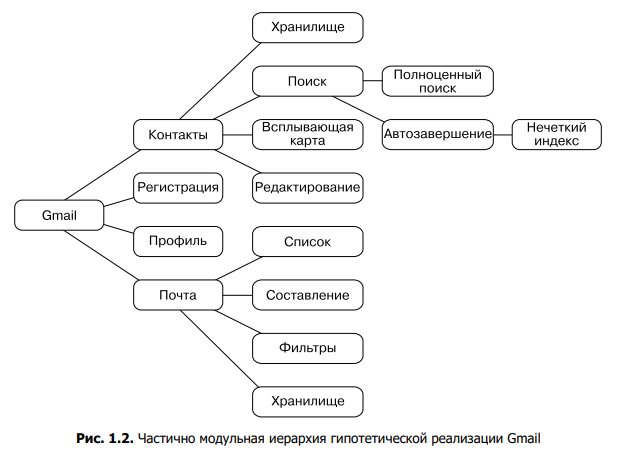

Принципы манифеста реактивного программирования, определяющего общую терминологию и описывающего основные вызовы:
- Она должна реагировать на действия своих пользователей - отзывчивость;
- Она реагировать на сбои и оставатся доступной - устойчивость;
- Она должна реагировать на колебания нагрузки - эластичность;
- Она реагировать на ввод - ориентированность на обмен сообщениями.

а также _Поддерживаемость_ и _расширяемость_.

### Анатомия реактивного приложения на примере Gmail
Высокоуровневые характеристики нашего приложения:
- Приложение должно предагать пользовалю просмотр почтовых ящиков и выводить содержимое;
- Система должна хранить все письма и обеспечивать их доступность;
- Пользователеь должен иметь возможность составлять и отправлять письма;
- Приложение предоставляет пользователю комфортное управление контактами и письсами;
- Поисковик для удобного нахождения писем.

_Некоторые из данных пунктов пересекаются между собой больше, чем другие_

По изложенным соображениям функциональность Gmail лучше иерархически разбить на все меньшие и меньшие составляющие. Результатом этого процесса станет иерархия компонентов, которые нужно разработать и развернуть. 

Каждый компонент может быть сложным с точки зрения своей функциональности, как в случае с реализацией поисковых алгоритмов, или в плане развертывания и управления, как это будет с хранилищем писем для миллиардов пользователей. Но описание области ответственности данных компонентов всегда будет простым.

### Справляемся с нагрузкой
Для хранения всех писем и обработки миллионов действий пользователей необходимы огромные ресурсы, в одном устройстве таких мощностей не вместить, да и будет задержка между одним концом света и другим, поэтому используем Шаблон Сегментирования (что-то большое разбито на что-то маленькое, которые занимают множество мест). По данным пользователя ищет подходящий для него сегмент, в котором и хранятся данные о нем

Разбивая систему на распределяемые части, вы получаете возможность масштабировать ее производительность, увеличивая количество сегментов для обслуживания пользователей. Теоретически, если сегменты не зависят друг от друга, систему можно масштабировать бесконечно. На практике же комбинирование и развертывание приложения на миллионы узлов по всему миру требуют существенных затрат и должны быть оправданными.

### Обработка сбоев
Чтобы быть готовыми к сбоям, вы должны иметь возможность продолжать работу даже после того, как что-то пошло не так - сегмент допустим отвалился.

Основные варианты решения:
- Реплекация "Активный к пассивному" - реплики согласуют между между собой какая будет принимать обновления. Когда активная реплика не работает, то переключается на другую;
- Согласуемая репликация с несколькими активными копиямит - каждое обновление обновляет все реплики;
- Оптимистичная репликация с несколькими активными копиями -  несколько активный реплик согласуют между собой обновление и откавают транзакциии в случае конфликтов или отменяет конфликтующие изменения;
- Бесконфликтная репликация типа данных;

###  Придание системе отзывчивости
... Серверная часть состоит из множества сервисов, разделение и взаимодействие которых является результатом применения шаблона «простой компонент». Сам по себе этот шаблон не предоставляет сдержек и противовесов, которые не дают архитектуре превратиться в большой бардак, где почти все сервисы общаются между собой.

Поскольку проблема заключается в неконтролируемом взаимодействии между произвольными серверными сервисами, чтобы решить ее, следует сосредоточиться _на путях коммуникации в рамках всего приложения_, проектируя их определенным образом. Это называется `потоком сообщений`.

Еще одно преимущество тщательно продуманного потока сообщений состоит в облегчении тестирования и покрытия всех сценариев взаимодействия. Имея понятную архитектуру потока сообщений, мы можем с уверенностью сказать, с какими сервисами взаимодействует компонент и чего ожидать от него в плане пропускной способности и задержек.

### Взаимодействие нереактивных компонентов
Последний важный аспект создания приложений в соответствии с реактивными принципами заключается в том, что в большинстве случаев нам придется интегрироваться с уже существующей инфраструктурой или системами, которые не обладают необходимыми характеристиками. 
- драйверы устройств, которым недостает инкапсуляции и которые при сбое завершают весь процесс;
- программные интерфейсы, выполняющие свои функции синхронно, блокируя тем самым вызывающий код и не давая ему реагировать на другой ввод или истечение времени ожидания;
  
Для устранения большинства этих проблем используются шаблоны управления ресурсами. Основная идея состоит в добавлении необходимой инкапсуля   ции и асинхронных границ путем взаимодействия с ресурсом в рамках отдельного реактивного компонента и применения дополнительных потоков, процессов и компьютеров по мере необходимости.
