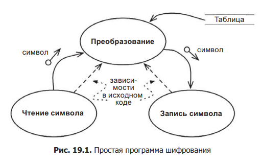
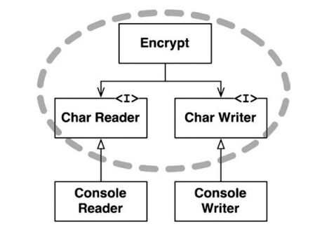

#### Уровень
Это "удаленность от ввода и вывода". Чем дальеш политика от ввода и вывода, тем выше её уровень. Политики, управляющие вводом и выводом, являются самыми низкоуровневыми в системе.

Направления потоков данных показаны на диаграмме извилистыми сплошными стрелками. Правильно спроектированные зависимости в исходном коде показаны пунктирными стрелками.

Компонент, выполняющий преобразование, — это самый высокоуровневый компонент в данной системе, потому что он дальше других находится от ввода и вывода.

Обратите внимание, что потоки данных и зависимости в исходном коде не всегда указывают в одном направлении

**Более удачная архитектура** для этой системы изображена. Обратите внимание на пунктирную границу, окружающую класс Encrypt, и интерфейсы CharWriter и CharReader. Все зависимости, пересекающие границу, указывают внутрь. Этот модуль является элементом высшего уровня в системе

