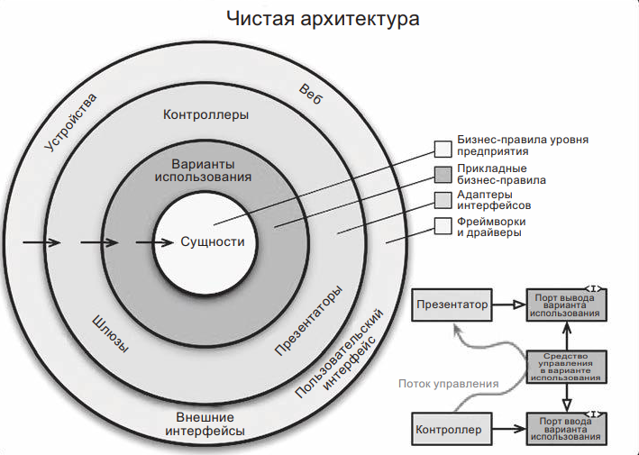

Чем ближе к центру, тем выше уровень. Внешние круги — это механизмы. Внутренние — политики. Ничто во внутреннем круге ничего не знает о внешних кругах.

Главным правилом, приводящим эту архитектуру в действие, является правило зависимостей:

``Зависимости в исходном коде должны быть направлены внутрь, в сторону
высокоуровневых политик. Если вдруг хотим до внешних границ достучатся то необходимо использовать DIP.``

По мере движения внутрь уровень абстракции и политик увеличивается. Самый внешний круг включает низкоуровневые конкретные детали. По мере приближения к центру программное обеспечение становится все более абстрактным и инкапсулирует все более высокоуровневые политики.

#### Сущности

Сущности заключают в себе критические бизнес-правила уровня предприятия.

Если вы пишете только одно приложение и не для предприятия, эти сущности становятся бизнес-объектами приложения. Они
инкапсулируют наиболее общие и высокоуровневые правила. Их изменение маловероятно под влиянием внешних изменений.

#### Варианты использования

Программное обеспечение на уровне вариантов использования содержит бизнес-правила, характерные для приложения. Оно
инкапсулирует и реализует все варианты использования системы. Варианты использования организуют поток данных в сущности
и из них и требуют от этих сущностей использовать их критические бизнес-правила для достижения своих целей.

#### Адаптеры интерфейсов

Программное обеспечение на уровне адаптеров интерфейсов — это набор адаптеров, преобразующих данные из формата, наиболее
удобного для вариантов использования и сущностей, в формат, наиболее удобный для некоторых внешних агентов, таких как
база данных или веб-интерфейс.

Именно на этом уровне целиком находится архитектура MVC графического пользовательского интерфейса. Презентаторы,
представления и контроллеры — все принадлежат уровню адаптеров интерфейсов.

Аналогично на этом уровне преобразуются данные из формата, наиболее удобного для вариантов использования и сущностей, в
формат, наиболее удобный для инфраструктуры хранения данных (например, базы данных).

Никакой код, находящийся в других внутренних кругах, не должен ничего знать о базе данных.

#### Фреймворки и драйверы

Самый внешний уровень модели обычно состоит из фреймворков и инструментов, таких как база данных и веб-фреймворк. Как
правило, для этого уровня требуется писать не очень много кода, и обычно _этот код играет роль связующего звена со
следующим внутренним кругом_.

#### Пересечение границ

Допустим, что вариант использования должен вызвать презентатора. Такой вызов нельзя выполнить непосредственно, потому что иначе нарушится правило зависимостей: никакие имена, объявленные во внешних кругах, не должны упоминаться во внутренних. Поэтому вариант использования должен вызвать интерфейс, объявленный во внутреннем круге, а презентатор во внешнем круге должен реализовать его.

Тот же прием используется для всех пересечений границ в архитектуре. Мы используем преимущество динамического полиморфизма, чтобы обратить зависимости в исходном коде в направлении, противоположном потоку управления, и тем самым соблюсти правило зависимостей при любом направлении потока управления.

#### Какие данные пересекают границы
Обычно через границы данные передаются в виде простых структур. При желании можно использовать простейшие структуры или объекты передачи данных (DTO). Данные можно также передавать в вызовы функций через аргументы. Или упаковывать их в ассоциативные массивы или объекты. Важно, чтобы через границы передавались простые, изолированные структуры данных.