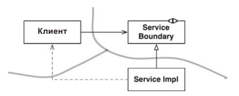
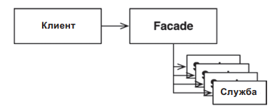

Полноценные архитектурные границы обходятся дорого. Они требуют определения двусторонних пограничных интерфейсов, структур для входных и выходных данных и управления зависимостями для выделения двух сторон в компоненты, компилируемые и развертываемые независимо. Это требует значительных усилий для создания и сопровождения.

#### 1 Способ. Пропускаем развертывание зависимо
Один из способов сконструировать неполную границу — проделать все, что необходимо для создания независимо компилируемых и развертываемых компонентов, и затем просто оставить их в одном компоненте.

#### 2 Способ. Одномерные границы
Показана более простая схема, помогающая зарезервировать место для последующего превращения в полноценную границу. Это пример традиционного шаблона «Стратегия». Клиенты пользуются интерфейсом ServiceBoundary, который реализуют классы ServiceImpl.

Здесь имеет место инверсия зависимости, необходимая для отделения клиента от класса ServiceImpl. Также должно быть ясно, что разделение может очень быстро стираться, о чем свидетельствует пунктирная стрелка на диаграмме.

#### 3 Способ. Фасад
Еще более простой подход к организации границ дает шаблон «Фасад». Граница определяется простым классом Facade c методами, представляющими службы и реализующими обращения к службам, к которым клиенты не должны иметь прямого доступа.

