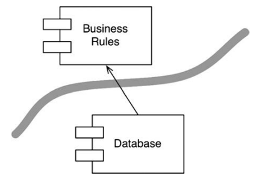

Разработка архитектуры программного обеспечения — это искусство проведения разделяющих линий, которые я называю границами. 
Границы отделяют программные
элементы друг от друга и избавляют их от необходимости знать, что находится по ту сторону. 
- Некоторые из этих линий можно провести на самых ранних этапах развития проекта — даже до появления первого программного кода.
- Другие проводятся намного позже. 

Границы, проводимые на ранних этапах, призваны отложить принятие решений на как  можно долгий срок и предотвратить загрязнение основной бизнес-логики  этими
решениями. 
Хорошая архитектура позволяет принимать эти решения в самый последний момент без существенного влияния на саму архитектуру

#### Какие границы проводить и когда?

Отделять линиями нужно все, что не имеет значения. 
- Графический интерфейс не имеет значения для бизнес-правил, поэтому между ними нужно
провести границу. 
- База данных не имеет значения для графического интерфейса, поэтому между ними нужно провести границу. 
- База данных не имеет значения для бизнес-правил, поэтому между ними нужно провести границу.

##### База данных находится за интерфейсом
Бизнес-правилам требуется только набор функций для извлечения и сохранения данных. Это позволяет нам скрыть базу данных за интерфейсом.  
  
Обратите внимание на стрелки, исходящие из класса DatabaseAccess. Они
обе выходят из класса DatabaseAccess, а это значит, что никакой другой класс
не знает о существовании DatabaseAccess

##### Компоненты с бизнес-правилами и базой данных

   
_Менее важный компонент зависит от более важного компонента_

Направление этой стрелки показывает, что компонент Database не имеет значения для BusinessRules, но Database не может существовать без BusinessRules.

Проведя границу и нарисовав стрелку, мы теперь видим, что Database можно заменить интерфейсом какого-то другого вида — для BusinessRules это не важно.

#### Архитектура с плагинами

Основные бизнес-правила хранятся отдельно и не зависят от компонентов, которые являются необязательными или могут быть реализованы в множестве разных форм. Это шаблон, что используется в системах, допускающих подключение сторонних сменных модулей — плагинов.

В таком дизайне пользовательский интерфейс считается плагином, мы можем позволить подключать множество разных пользовательских интерфейсов. Это могут быть веб-интерфейсы, интерфейсы клиент/сервер, интерфейсы служб, консольные интерфейсы или основанные на других способах взаимодействия с пользователем

#### Заключение  
Прежде чем провести линии границ в архитектуре программного обеспечения, систему нужно разделить на компоненты. Некоторые из этих компонентов реализуют основные бизнес-правила; другие являются плагинами, содержащими функции, которые не имеют прямой связи с бизнес-правилами. Затем можно организовать код в компонентах так, чтобы стрелки между ними указывали в одном направлении — в сторону бизнес-правил.

В этом без труда можно заметить принципы инверсии зависимостей и устойчивости абстракций. _Стрелки зависимостей направлены от низкоуровневых деталей в сторону высокоуровневых абстракций._
