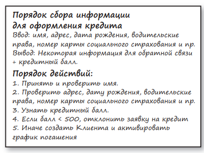

**Бизнес Правила** - это правила, делающие или экономящие деньги независимо от наличия или отсутствия их реализации на компьютере. Они делают или экономят деньги, даже когда выполняются вручную.

Банк взимает N% за кредит — это бизнес-правило, которое приносит банку деньги. И неважно, имеется ли компьютерная программа, вычисляющая процент, или служащий вычисляет его на счетах.

**Критические Бизнес Правила** - это решающие для бизнеса правила, которые будут существовать и без автоматизированной системы. Данные, которые необходимо для Критических Бизнес Правил - это **Критические Бизнес Данные**

#### Сущности
**Сущность** — это объект в компьютерной системе, воплощающий небольшой набор критических бизнес-правил, оперирующих критическими бизнес-данными. Объект-сущность или содержит критические бизнес-правила в себе, или имеет простой доступ к ним. Интерфейс сущности состоит из функций, реализующих критические бизнес-правила и оперирующих этими данными

##### Варианты использования
Некоторые бизнес-правила делают или экономят деньги, определяя и ограничивая деятельность автоматизированной системы - не могут выполнятся вручную, появляются только в приложениях. Это **Варианты использования**, что характерны для конкретного приложения

Варианты использования определяют, как и когда вызываются критические  бизнес-правила в сущности. Варианты использования управляют действиями сущности.

Это очень важно. Варианты использования не описывают, как выглядит система для пользователя. Они описывают только конкретные правила работы приложения, определяющие порядок взаимодействий между пользователями и сущностями. Для вариантов использования абсолютно неважно, как система осуществляет ввод/вывод данных.

Вариант использования — это объект. Он имеет одну или несколько функций, реализующих конкретные прикладные бизнес-правила. Он также имеет элементы данных, включая входные данные, выходные данные и ссылки на соответствующие сущности, с которыми он взаимодействует.

Сущности не знают ничего о вариантах использования, контролирующих их. Это еще один пример ориентации зависимостей в соответствии с принципом инверсии зависимостей (Dependency Inversion Principle). Высокоуровневые элементы, такие как сущности, ничего не знают о низкоуровневых элементах, таких как варианты использования. Напротив, низкоуровневые варианты использования знают все о высокоуровневых сущностях

#### Заключение

Бизнес-правила являются причиной существования программной системы. Они составляют основу функционирования. Они порождают код, который делает или экономит деньги. Они — наши семейные реликвии.

Бизнес-правила должны оставаться в неприкосновенности, незапятнанными низкоуровневыми аспектами, такими как пользовательский интерфейс или база данных. В идеале код, представляющий бизнес-правила, должен быть сердцем системы, а другие задачи — просто подключаться к ним. Реализация бизнес-правил должна быть самым независимым кодом в системе, готовым к многократному использованию.