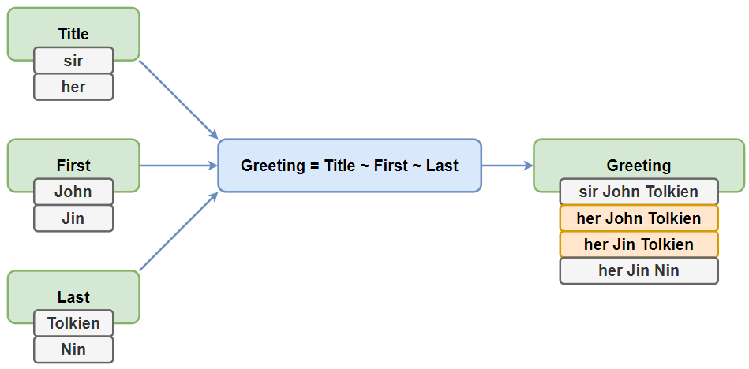
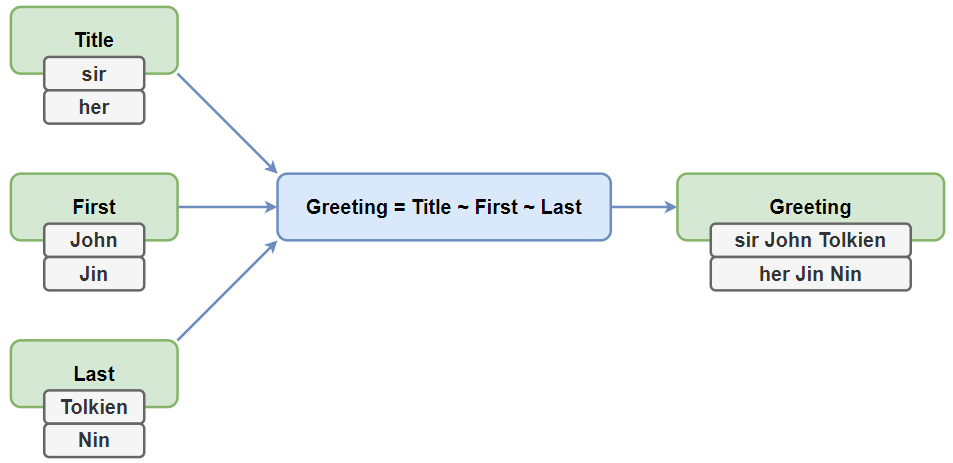
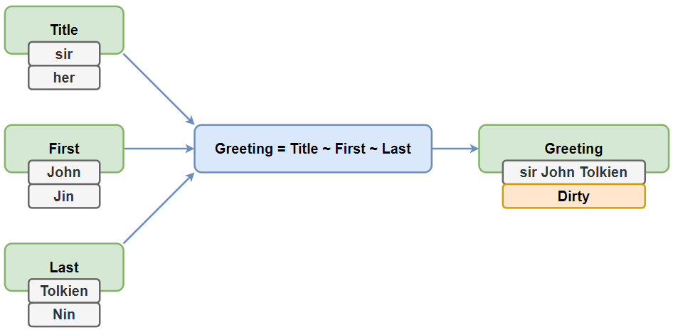
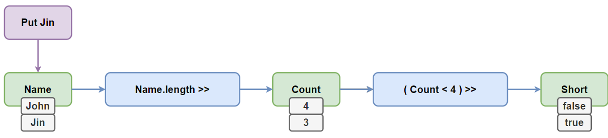
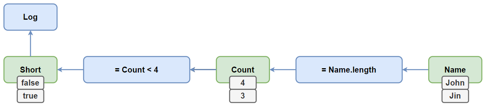
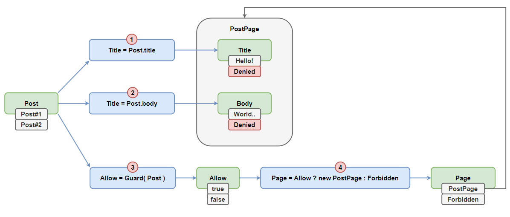
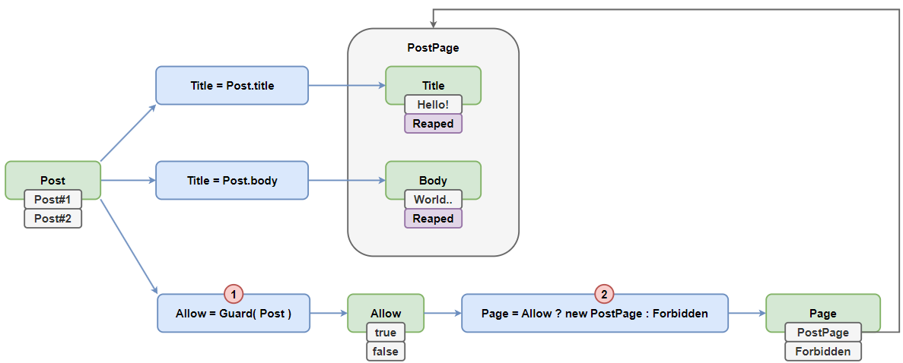
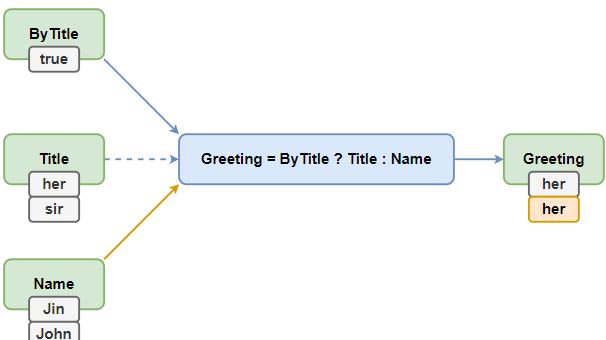
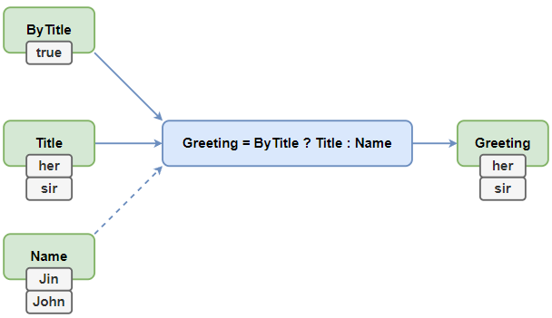

[Анализ библиотек](https://page.hyoo.ru/#!=z8ref1_2u48hz)


## Реактивные парадигмы

### Процедурная
Запискается процедура обновления, которая читает состояние, вычисляет другие и записывает их.

```typescript
let Name = 'ban'
let Count;
let IsShort;
let IsShortLast;

// Инвариант, где состояние Count зависит от Name
setInterval(() => { Count = Name.length });

// Инвариант, где состояние IsShort зависит от Count
setInterval(() => { IsShort = Count < 4 });

setInterval(() => {
    if (IsShort === IsShortLast) return;
    console.log(IsShort);
    IsShortLast = IsShort;
})

Name = 'John';
```

### Функциональная
[... впизду писать](https://page.hyoo.ru/#!=r5b96b_md7hr5/View'r5b96b_md7hr5'.Details=🤯%20Func)

### Ячеистое
Некоторым компромиссом между функциональным и процедурным подходом является подход с реактивными ячейками.
Реактивные ячейки - атомы, сигналы - это мутабельные контейнеры, которые связаны друг с другом через замкнутые функции.

```typescript
const Name = observable('ban');

// как в Mobx есть какой-то механизм
// который связывается значения 

// Name с Count
const Count = computed(() => Name().length)

// Count с IsShort
const IsShort = computed(() => Count() < 4);

autorun(() => console.log(Short()))

Name.next('John');

```

Возможно это благодаря тому, что реактивные инварианты не обязаны быть чистыми функциями, но обязаны быть функциями идемпотентными. То есть они могут зависеть от изменяемого состояния, но только, если оно реактивно.

Большинство современных реактивных систем выполнены именно в этом подходе. Яркие представители: CellX, MobX, WhatsUp.

К сожалению, проблема с потреблением памяти тут ещё более значительна, так как на каждую ячейку создаётся по нескольку замыканий. Кроме того, у этого подхода есть сложности с отладкой, так как нет простого доступа через отладчик к изолированному в замыкании состоянию.

### Объектный
Вопрос декомпозии и исследуемости хорошо закрывает объектная парадигма, где программа состоит из множества объектов, обладающих состояниями, связанных инвариантами в единый граф. Код в этом стиле выглядит так же, как и обычный ООП код, но с добавлением реактивных мемоизаторов..

```typescript

class State {
    
    @mem Name(next = 'ban') {
        return next;
    }

    @mem Count() {
        return this.Name().length;
    }

    @mem IsShort() {
        return this.Count() < 4;
    }
}

class App {

    @mem State() {
        return new State();
    }

    @mem logging() {
        console.log(this.IsShort())
    }
}

const app = new App
app.logging()

app.name( 'John' )

```

_Многие, наверняка, слышали утверждение, что "инвалидация кешей - один из сложнейших вопросов в программировании". Так вот, в реактивном рантайме, такой вопрос вообще не стоит.

Этот подход мне видится наиболее оптимальным, так как он хорошо укладывается в то, как мыслит человек (а ему привычно взаимодействовать с объектами), и в то, как работает компьютер (объект - это просто мутабельная структура в памяти). Рантайм чётко понимает какой метод какое состояние вычисляет. А объектная декомпозиция позволяет легко это всё масштабировать. Именно поэтому объектный стиль и используется в $mol_wire, как основной._

## Наблюдение за измениями
Как рантайм может узнать об изменениях?

### Периодическая сверка
Состояния хранят лишь значения и всё. **Рантайм периодически сверяет текущее** значение с предыдущим. И если они отличаются - запускает реакции.

```typescript
if (start !== prev_state) reactions()
```
 Беда этого подхода в том, что на **каждый чих выполняется большой объём работы только лишь для того, чтобы выяснить, что почти ничего не поменялось**. Так, например, работает Angular, Svelte, React. React-redux где на каждое изменение Store происходят проверку в каждом вызываемом ранее хук useSelector для сверки значения
 
### Возникновение события
Каждое состояние хранит дополнительно список функций обработчиков изменения. При каждом изменении состояния вызываются все подписчики.

```typescript

// при изменение состояния вызывается
for(const reaction of this.reactions) {
	reaction()
}
```
Это может быть инициировано вручную, через сеттер или прокси. 

Состояние ничего не знает про соседние состояния, а взаимодействие всегда одностороннее. Это сильно ограничивает возможные алгоритмы оптимизации. А также усложняет отладку, ведь чтобы узнать кто там от кого как зависит - это целый квест.

А самое печальное: хранение массива из замыканий кушает много памяти. И с этим ничего не сделать.

### Список подписчиков
Состояния хранят прямые ссылки друг на друга, образуя глобальный граф. Для коммуникации с соседями достаточно просто пробежаться по массиву и дёрнуть нужный метод у соседнего стейта.

```typescript
// on master change
// при изменении состояния мы говорим всем зависимым, что они устарели.
for(const slave of this.slaves) {
	slave.obsolete()
}
// on slave complete
// при завершении вычисления состояния, мы говорим всем зависимостям, что вычисление закончено
for(const master of this.masters) {
	master.finalize()
}
```

## Эквивалентные изменения
Порой значение меняется на эквивалентное (равносильное). И тут есть разные подходы к отсечению вырожденных вычислений..

### Реакция на каждое действие
В библиотеках типа RxJS каждое значение является уникальным событием, что приводит к ненужному запуску реакций.

`777 != 777`

Чтобы этого не происходило, нужно писать дополнительный код, который часто забывают, и потом огребают.

### Сравнение по ссылке
Если состояние не поменялось, то реакции не срабатывают. А если поменялось, даже на эквивалентное значение, то срабатывают.

```
        777 == 777
        
[ 1, 2, 3 ] != [ 1, 2, 3 ]
```

### Глубокое сравнение
Делают глубокое сравнение нового и старого значения

```
        777 == 777
        
[ 1, 2, 3 ] == [ 1, 2, 3 ]

[ 1, 2, 3 ] != [ 3, 2, 1 ]
```

Это позволяет отсекать лишние вычисления как можно раньше - в момент внесения изменений. А не в момент рендеринга заново сгенерированного Virtual DOM в реальный DOM, как это часто происходит в React, чтобы узнать, что в доме-то менять и нечего.

Глубокое сравнение - это, безусловно, сама по себе **более дорогая операция**, чем просто сравнение двух ссылок. Однако, рано или поздно, сравнить всё содержимое всё равно придётся. Но гораздо быстрее это сделать пока данные рядом, а не когда они разлетятся по тысяче компонент в процессе рендеринга.

Тем не менее, если данные поменялись, то полетят дальше по приложению и будут глубоко сравниваться снова и снова, что никуда не годится. Поэтому тут **важно реализовывать кеширование результата глубокого сравнения для каждой пары сравниваемых объектов.**

### Структурная сверка
[... не особо понял](https://page.hyoo.ru/#!=tu7bfb_5w3t69/View'tu7bfb_5w3t69'.Details=%F0%9F%94%80%20Reconcile)

## Энергичность реакций
Вычислять зависимые состояния можно как можно раньше, а можно как можно позже, вплоть до отказа от вычислений, если это возможно..

### Мгновенные реакции
Пересчёт зависимых состояний происходит сразу же при изменении зависимости. Если нам нужно изменить несколько состояний подряд, то это может привести к лишним вычислениям.



Более того, эти лишние промежуточные вычисления производят **неконсистентное состояние**, вычисляемое частично из уже обновлённых состояний, а частично из ещё не обновлённых. А неконсистентное состояние, пусть даже и временно, - это очень опасная штука.

### Отложенные реакции
Чтобы избежать глитчей пересчёт может откладываться на потом, чтобы выполнять его лишь один раз, сколько бы зависимостей ни было обновлено.



```

// после того как ф-ия завершится
// стригерятся все реакции вызываемые на измения от этих действий
// если есть общие реакции то они выполнятся только 1 раз
defer(() => {
    action1()
    action2()
    action3()
})
```

Однако, пересчёт будет произведён в любом случае, даже если результат нам не пригодится.

### Ленивые вычисления
В моделях реактивности с затягиванием возможно ленивое вычисление инвариантов - только в момент, когда зависимое состояние **действительно потребовалось**.



При изменении исходных состояний, мы не вычисляем зависимые и даже не планируем их вычисление, а лишь помечаем их как устаревшие. **И если впоследствии к ним обратиться, то они начнут вычисляться.**

Это одновременно и **самый экономный подход** и **самый консистентный**, так как гарантирует, что, когда бы мы ни обратились к состоянию, полученное значение будет актуальным.

## Инициатор пересчёта

Не смотря на то, что начинается всё с того, что кто-то что-то поменял, финальное решение пересчитывать ли тот или иной инвариант может принимать как зависимость, так и зависимое состояние.

### Зависимость проталкивает (Push)
При изменении зависимости безусловно срабатывают реакции, которые вычисляют и пишут в зависимые состояния новые значения (RxJS, Effector).


Действуя по принципу проталкивания мы будем часто попадать в ситуации вида: долго-долго вычисляли какое-то значение, а оно в итоге никому не понадобилось, ибо потребитель был уничтожен.

### Зависимый затягивает (Pull)
При обращении к зависимому состоянию, происходит вычисление инварианта, который вытягивает значения из зависимостей и возвращает актуальное значение (CellX, MobX и Vue)



Тут уже чисто логически нам всегда известно, что если вычисление произошло, то его результат кому-то нужен. А если не нужен, то и вычисления не произойдёт. Поэтому подход с затягиванием видится мне более практичным.

## Порядок реакций
С порядком исполнения реакций есть свои особенности, которые зачастую отдаются на откуп рандому. Однако, давайте разберём все возможные варианты..

### Subscribe: По времени подписки
Какая реакция появилась раньше, та и срабатывает раньше.

Получается **скрытое состояние**, влияющее на работу приложения через разный порядок побочных эффектов, которые могут давать различные взаимные наводки. Получаем нестабильность поведения, что осложняет отладку и тестирование.

Это - типичная беда большинства библиотек.

### Event: По времени возникновения события
Предположим нам удалось тем или иным способом зафиксировать порядок подписок. Однако, есть и другой источник нестабильности - порядок совершения действий.

### Deep: По глубине зависимости
Некоторые библиотеки используют так называемую топологическую сортировку графа, чтобы пересчитывать инварианты в оптимальном порядке от менее зависимых к более зависимым.



Сначала будет высчитан обновленный PostPage, потом же только перерасчитается Page, где будет ясно, что PostPage нам то и не понадобится 😐😕.

### Code: По положению в программе
Предпочтительнее, чтобы реакции отрабатывали в том порядке, который в явном виде задан в коде. Это гарантирует, что владелец будет актуализирован раньше, чем всё, чем он владеет.



Тут уже сначала будет обновлён Allow, потом Page, что приведёт к потере PostPage и, как следствие, уничтожению PostPage со всеми состояниями внутри, без их вычисления.

## Конфигурация потоков данных
В реактивной системе все состояния связаны друг с другом инвариантами в единый граф. Когда мы что-то меняем с одной стороны этого графа, рантайм обеспечивает каскадный пересчёт зависимых состояний. Такие последовательности пересчётов являются ничем иным, как [_информационными потоками_](https://page.hyoo.ru/#!=k5qqn7_hg4hp6) (data flow). 

Чем более эти потоки прямолинейны, чем меньше они разветвляются и задевают нерелевантные изменениям состояния, тем эффективней работает система.

И тут есть два подхода к оптимизации информационных потоков.

### Ручная
В библиотеках на основе **проталкивания**, автоматизировать потоки сложно, поэтому тут процветает ручное управление ими. А значит мы получаем ошибки двух типов:

1. Мы можем забыть на что-то подписатся. В примере мы забыли подписатся на Title, хотя используем его в расчетах Greeting
2. Мы можем забыть отписатся в результате чего будут лишние вычисления.

Сложность в ручной оптимизации потока, приходится ручками всё делать, и как итог происходит больше кол-во лишний вычислений.



### Автоматическая
В библиотеках, основанных на **затягивании**, обычно применяется автотрекинг зависимостей. Это мало того, что гораздо надёжней, так ещё и крайне просто для прикладного программиста. Ему не надо думать о потоках данных вообще - они динамически конфигурируются рантаймом наиболее оптимальным (для данного состояния приложения) образом.



Тут программисты делятся на 3 категории:
1. -ые боятся магии
2. -ые ну работает и работает
3. -и кто знают о том как это работает и используют

_Практика показывает, что (при автоматизации) прикладного кода получается на порядки меньше, сам он гораздо проще и надёжнее, а приложение работает быстрее._

## Нештатные ситуации
[... информация](https://page.hyoo.ru/#!=386pml_vyd0eg)
- Нестабильная работа
- Прекращение работы
- Откат к стабильному состоянию - good
- Индикация ошибки и ожидание восстановления - the best

## Циклические зависимости
Иногда у нас могут получаться циклические зависимости. Порой мы их можем захотеть сделать намеренно.

Однако, в подавляющем большинстве случаев циклически зависимости свидетельствуют о проблеме с логикой, так что их обычно стараются избегать.

- Невозможны - norma
- Бесконечный цикл
- Произвольный результат
- Приводят к ошибке - the best

## Глубина зависимостей
Как правило, глубина зависимостей остаётся сравнительно не большой, не превышающей пары десятков состояний.

Но порой зависимости могут вырастать на неприличную глубину. Это особенно характерно для приложений, где сам пользователь может управлять тем, кто от кого и как зависит. 

Типичные примеры: электронная таблица или диаграмма Ганта.

### Ограничена константой
Некоторые библиотеки борятся с циклическими зависимостями путём введения ограничения на число пересчётов за раз.

```typescript

for( let i = 0; i < MAX_REPEATS; ++i ) {
	if( !dirty ) return
	changeDetection()
}
throw new Error( 'Too many change detection repeats' )

```

### Ограничена стеком
Есть ограничения только в размере стека, а он не бесконечен, но конечно больше чем значение у **Ограничения константой**

```
first() {
	this.second()
}
second() {
	this.third()
}
third() {
	this.etc()
}
```

### Не ограниче на
Позволяет работать с зависимостями произвольной глубины на сколько хватит компью

```typescript
while(reactions.length) {
	reactions.shift().execute()
}
```

## Атамарность изменений
Пока что мы говорили про нештатные ситуации при вычислении инвариантов. Однако, они могут возникнуть и на подлёте - во время внесения изменений в несколько исходных состояний одновременно.

### Одного отдельного состояния

```
Name = 'John'
Count = 4

Name = 'Jin'
throw 'function is not a function'
Count = 3 // still 4
```


### Для первичных состояний (Транзакции)
Либо все исходные состояния получат свои обновления, и пойдут обновляться зависимые состояния, либо не изменится никто, и зависимые состояния обновляться тоже не пойдут.

```
Name = 'John'
Count = 4
@transaction update() {
	this.Name = 'Jin' // will still 'John'
	throw 'function is not a function'
	this.Count = 3
}
```

### Для всех состояний
В некоторых библиотеках транзакцию могут откатить не только исключения возникшие непосредственно при внесении изменений, но и исключения в инвариантах, которые пошли вычисляться в результате внесённых изменений.

## Внешние взаимодействия
Порой инвариант требует [асинхронной коммуникации](https://page.hyoo.ru/#!=xhs1ob_xb6tgo). Например, при тяжёлых расчётах в отдельном воркере

### Синхронные инварианты
сли поддерживается лишь синхронная реактивность, а нам нужно выполнить какой-то асинхронный вызов, то он обычно идёт где-то в сторонке

### Асинхронные инварианты
сли же поддерживаются и асинхронные инварианты, то рантайм поддерживает согласованность автоматически. Типичное решение - через механизм работы с нештатными ситуациями